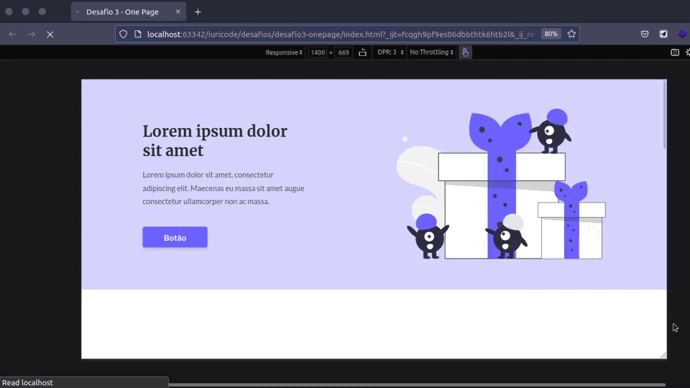

# Codelândia

## About

This project was developed for the third challenge of the **[Codelandia](https://discord.com/invite/QevDJqCzaY)** community. The aim of this project was to practice frontend development by developing one page website.


---
## Technologies

- **HTML5**
- **CSS3**
- **JavaScript**

---

## Layout

You can view the project layout through the links below:

- **[Figma](https://www.figma.com/file/Yb9IBH56g7T1hdIyZ3BMNO/Desafios---Codel%C3%A2ndia?node-id=3743%3A36)**<br>

---

## Getting started

```bash
# Clone the project and access the folder.
git clone https://github.com/lgolin/codelandia-desafio03.git
cd codelandia-desafio03
```

**OBS:** It is recommended that you use liveserver to access the project on your local server [Live Server](https://marketplace.visualstudio.com/items?itemName=ritwickdey.LiveServer)

---

**Made with ❤ by [Laís Golin](https://github.com/lgolin/).**
